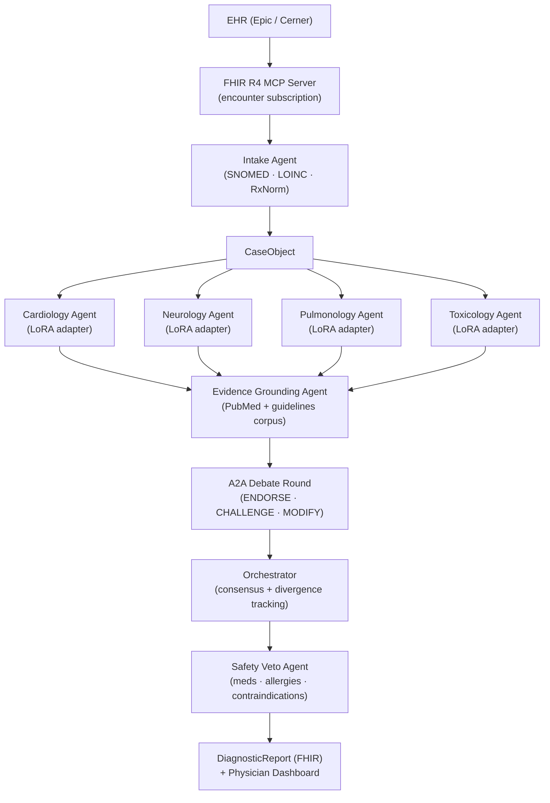

# Shadi

**Multi-agent clinical diagnostic reasoning system for emergency medicine.**

A patient case arrives from the EHR via FHIR R4. Five specialist agents — each running a domain-specific LoRA adapter on a shared 70B base model — reason independently over the case, debate via a structured A2A protocol, and produce a ranked differential diagnosis with confidence scores, evidence citations, and a safety veto layer. The attending physician receives this before walking into the room.

---

## Why This Exists

Diagnostic errors in emergency medicine are estimated to affect 12 million patients annually in the US. The window between triage and physician assessment is the highest-leverage moment to surface differential diagnoses that a single clinician might miss under time pressure. Shadi is designed to run in that window — locally, with no PHI leaving the machine.

---

## Architecture



### Agent Pipeline

| Stage | Agent | Responsibility |
|---|---|---|
| 1 | **Intake** | Parse unstructured triage notes; extract SNOMED CT, LOINC, RxNorm codes; build `CaseObject` |
| 2 | **Specialists ×4** | Cardiology, neurology, pulmonology, toxicology reason concurrently; no cross-talk yet |
| 3 | **Evidence Grounding** | Each specialist's findings cross-referenced against local PubMed + clinical guidelines corpus; unsupported claims flagged |
| 4 | **A2A Debate** | Agents exchange structured `ENDORSE / CHALLENGE / MODIFY` messages; orchestrator tracks consensus and divergence |
| 5 | **Safety Veto** | Every recommended diagnostic step and treatment cross-checked against active medications, allergies, and contraindications; unsafe items blocked before output |
| 6 | **Output Synthesis** | Top-5 ranked differential with confidence %, evidence citations, and next steps written as FHIR `DiagnosticReport`; surfaced on physician dashboard |

---

## Model Stack

Two inference servers run side-by-side. vLLM handles the specialists (LoRA hot-swap required); Ollama handles everything else. Both expose an OpenAI-compatible `/v1` API — agents route to the correct server via `inference_url` and `model` class attributes. See [ADR-002](docs/decisions/adr-002-model-assignments.md) for full rationale.

| Agent | Model | Server | Approx VRAM |
|---|---|---|---|
| Image analysis | `medgemma:27b` | Ollama | ~16 GB |
| Intake | `qwen2.5:7b` | Ollama | ~4.5 GB |
| Specialists ×4 (base) | `meditron:70b` FP4 | vLLM | ~38 GB |
| Specialist LoRA adapters ×4 | cardiology / neurology / pulmonology / toxicology | vLLM | ~8 GB |
| Evidence (retrieval) | `nomic-embed-text` | Ollama | ~0.5 GB |
| Evidence (claim eval) | `meditron:70b` (reuse) | vLLM | — |
| Safety veto | `phi4:14b` | Ollama | ~8 GB |
| Orchestrator synthesis | `deepseek-r1:32b` | Ollama | ~19 GB |
| **Model subtotal** | | | **~94 GB** |
| OS + services | | | ~15–20 GB |
| **Grand total** | | | **~109–114 GB** |

The DGX Spark's 128 GB unified memory leaves ~14–19 GB headroom for the evidence corpus index and concurrent case spikes. A laptop OOMs before the first specialist model finishes loading.

### The LoRA Adapter Trick

The four specialist agents share a single `meditron:70b` base load in FP4 (~38 GB). vLLM hot-swaps a domain LoRA adapter (~2 GB each) per request via `--enable-lora`. The result: four genuinely differentiated clinical specialists for the memory cost of one model. Loading four separate 70B weights would require ~160 GB — exceeding the hardware budget entirely.

---

## Hardware Requirements

| Requirement | Why |
|---|---|
| **128 GB unified memory** | All models + adapters + evidence corpus must be in memory simultaneously for real-time (<2 s) inference |
| **DGX Spark or equivalent** | Only desktop-class machine that meets the memory floor without moving to a data-center GPU |
| **Air-gapped (no cloud API)** | PHI cannot leave the machine; cloud APIs introduce ~200 ms round-trip latency per agent call, killing real-time performance |

A laptop (typically 16–32 GB) OOMs before the first specialist model finishes loading. A cloud API removes the air-gap guarantee required for HIPAA compliance.

---

## Safety Veto — Demo Scenario

The veto's most important moment: **thrombolytics contraindicated in aortic dissection**.

Aortic dissection and STEMI present with overlapping symptoms (chest pain, ST changes). A specialist agent may recommend tPA. Shadi's safety veto agent scans the patient's vitals, imaging flags, and medication context, identifies the aortic dissection risk, and blocks the recommendation with an explicit rationale before output reaches the physician.

This is a documented fatal error pattern in emergency medicine. The veto fires live and the dashboard shows exactly why the recommendation was blocked.

---

## Evaluation Methodology

Shadi is evaluated against **MIMIC-IV de-identified cases**, not just USMLE Q&A benchmarks. USMLE measures recall of medical knowledge; MIMIC-IV measures performance on real patient presentations with the noise, ambiguity, and incomplete information that characterizes actual emergency medicine. Both benchmarks are run; MIMIC-IV is the primary claim.

---

## Quick Start

### Prerequisites

- Docker + Docker Compose
- NVIDIA GPU with 128 GB+ unified memory (or DGX Spark)
- Python 3.11+
- `bun` (for dashboard)

### Run

```bash
cp .env.example .env
# Edit .env — set model paths, EHR connection strings, etc.

docker compose up
```

On first boot, pull the Ollama models (vLLM loads Meditron from the path in `.env`):

```bash
docker exec shadi-ollama-1 ollama pull medgemma:27b
docker exec shadi-ollama-1 ollama pull qwen2.5:7b
docker exec shadi-ollama-1 ollama pull nomic-embed-text
docker exec shadi-ollama-1 ollama pull phi4:14b
docker exec shadi-ollama-1 ollama pull deepseek-r1:32b
```

Services:
- `http://localhost:8000` — FastAPI backend
- `http://localhost:3000` — Physician dashboard
- `http://localhost:8080` — vLLM inference server (meditron:70b + LoRA)
- `http://localhost:11434` — Ollama inference server (all other models)

### Development

```bash
# Python backend
pip install -e ".[dev]"
uvicorn api.main:app --reload

# Dashboard
cd dashboard
bun install
bun dev
```

---

## Directory Structure

```
shadi/
├── agents/
│   ├── base.py                  # BaseAgent ABC
│   ├── intake/                  # Triage note parsing → CaseObject
│   ├── specialists/             # Cardiology, neurology, pulmonology, toxicology
│   ├── evidence/                # PubMed + guidelines cross-reference
│   ├── safety/                  # Safety veto agent
│   └── orchestrator/            # Fan-out, A2A debate, synthesis
├── fhir/                        # FHIR R4 MCP server + resource normalizer
├── a2a/                         # A2A protocol schema + debate round logic
├── models/                      # vLLM engine + LoRA adapter management
├── api/                         # FastAPI app + routes
├── dashboard/                   # Next.js physician dashboard
├── docs/decisions/              # Architecture Decision Records
└── tests/
    ├── fixtures/sample_cases/   # De-identified MIMIC-IV fixtures
    └── unit/
```

---

## Architecture Decision Records

| ADR | Decision |
|---|---|
| [ADR-001](docs/decisions/adr-001-architecture.md) | LoRA adapter strategy, A2A protocol design, air-gap rationale |
| [ADR-002](docs/decisions/adr-002-model-assignments.md) | Ollama model assignments per agent, two-server strategy, memory budget |

---

## Contributing

All architecture decisions must be documented in `docs/decisions/` before implementation. See `docs/decisions/adr-001-architecture.md` for the format.
