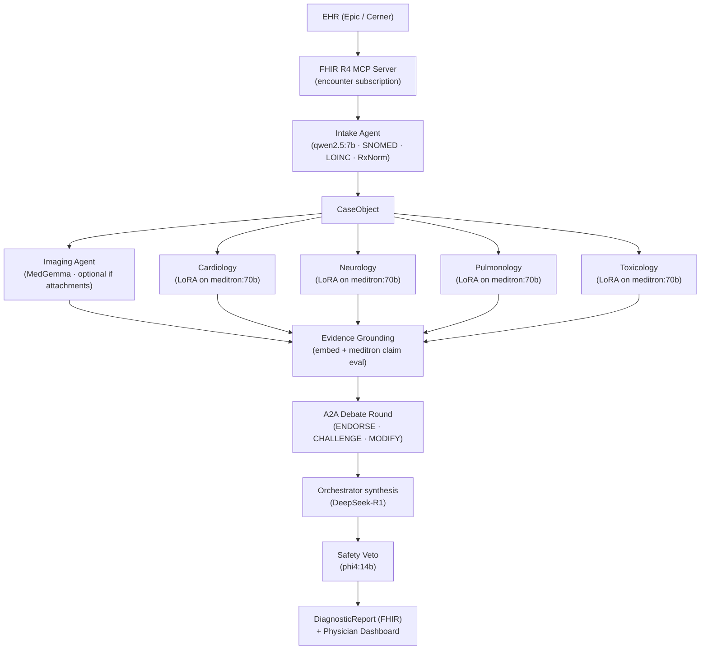

# Shadi

**Multi-agent clinical diagnostic reasoning system for emergency medicine.**

A patient case arrives from the EHR via FHIR R4. An **intake** agent turns unstructured triage text into a structured `CaseObject` (SNOMED CT, LOINC, RxNorm). When imaging is attached, a **multimodal imaging** agent (MedGemma — separate from the clinical specialists) interprets those studies. **Four domain specialist agents** — cardiology, neurology, pulmonology, toxicology — each run a domain-specific LoRA adapter on one shared Meditron-70B load in vLLM; they reason in parallel, then **evidence grounding** checks claims against a local PubMed and guidelines corpus. An **orchestrator** runs the structured **A2A** debate (`ENDORSE` / `CHALLENGE` / `MODIFY`), synthesizes consensus and ranked differentials, and a **safety veto** agent blocks unsafe recommendations before anything reaches the physician dashboard or FHIR `DiagnosticReport` output.

---

## Why This Exists

Diagnostic errors in emergency medicine are estimated to affect 12 million patients annually in the US. The window between triage and physician assessment is the highest-leverage moment to surface differential diagnoses that a single clinician might miss under time pressure. Shadi is designed to run in that window — locally, with no PHI leaving the machine.

---

## Architecture

Shadi is a **local, air-gapped** stack: two inference backends (vLLM for Meditron + LoRA specialists, Ollama for every other model), a FastAPI + arq worker surface, Postgres/pgvector for evidence retrieval, Redis for the job queue, and a Next.js physician dashboard. PHI never leaves the machine (see [ADR-001](docs/decisions/adr-001-architecture.md)).

**Specialist count:** exactly **four** LoRA-backed domain agents (cardiology, neurology, pulmonology, toxicology). The imaging agent uses MedGemma on Ollama — it is a multimodal preprocessor-style component, not a fifth LoRA specialist.



### Agent pipeline (end-to-end)

| Stage | Component | Responsibility |
|---|---|---|
| 0 | **EHR → MCP** | Subscribe to encounters; deliver FHIR R4 bundles into the app |
| 1 | **Intake** | Parse unstructured triage notes; extract SNOMED CT, LOINC, RxNorm codes; build `CaseObject` |
| 2a | **Imaging (optional)** | If `imaging_attachments` exist, MedGemma interprets images; outputs structured findings (skipped when no attachments) |
| 2b | **Specialists ×4 (LoRA)** | Cardiology, neurology, pulmonology, toxicology on shared `meditron:70b` with per-domain LoRA; reason concurrently; no cross-talk until debate |
| 3 | **Evidence grounding** | Retrieve from local vector index; evaluate whether evidence supports each claim (embedding model + Meditron reuse for claim eval) |
| 4 | **A2A debate** | Structured `ENDORSE / CHALLENGE / MODIFY` messages; orchestrator records consensus and divergence |
| 5 | **Orchestrator synthesis** | Rank differential, confidence scores, reconcile disagreement (dedicated reasoning model — ADR-002) |
| 6 | **Safety veto** | Cross-check diagnostics and treatments vs meds, allergies, contraindications; block unsafe items |
| 7 | **Output** | Top-ranked differential with evidence ties; FHIR `DiagnosticReport`; physician dashboard |

---

## Model Stack

Two inference servers run side-by-side. vLLM handles the specialists (LoRA hot-swap required); Ollama handles everything else. Both expose an OpenAI-compatible `/v1` API — agents route to the correct server via `inference_url` and `model` class attributes. See [ADR-002](docs/decisions/adr-002-model-assignments.md) for full rationale.

| Agent | Model | Server | Approx VRAM |
|---|---|---|---|
| Image analysis | `alibayram/medgemma:27b` | Ollama | ~17 GB |
| Intake | `qwen2.5:7b` | Ollama | ~4.5 GB |
| Specialists ×4 (base) | `meditron:70b` FP4 | vLLM | ~38 GB |
| Specialist LoRA adapters ×4 | cardiology / neurology / pulmonology / toxicology | vLLM | ~8 GB |
| Evidence (retrieval) | `nomic-embed-text` | Ollama | ~0.5 GB |
| Evidence (claim eval) | `meditron:70b` (reuse) | vLLM | — |
| Safety veto | `phi4:14b` | Ollama | ~8 GB |
| Orchestrator synthesis | `deepseek-r1:32b` | Ollama | ~19 GB |
| **Model subtotal** | | | **~94 GB** |
| OS + services | | | ~15–20 GB |
| **Grand total** | | | **~109–114 GB** |

The DGX Spark's 128 GB unified memory leaves ~14–19 GB headroom for the evidence corpus index and concurrent case spikes. A laptop OOMs before the first specialist model finishes loading.

### The LoRA Adapter Trick

The four specialist agents share a single `meditron:70b` base load in FP4 (~38 GB). vLLM hot-swaps a domain LoRA adapter (~2 GB each) per request via `--enable-lora`. The result: four genuinely differentiated clinical specialists for the memory cost of one model. Loading four separate 70B weights would require ~160 GB — exceeding the hardware budget entirely.

---

## Hardware Requirements

| Requirement | Why |
|---|---|
| **128 GB unified memory** | All models + adapters + evidence corpus must be in memory simultaneously for real-time (<2 s) inference |
| **DGX Spark or equivalent** | Only desktop-class machine that meets the memory floor without moving to a data-center GPU |
| **Air-gapped (no cloud API)** | PHI cannot leave the machine; cloud APIs introduce ~200 ms round-trip latency per agent call, killing real-time performance |

A laptop (typically 16–32 GB) OOMs before the first specialist model finishes loading. A cloud API removes the air-gap guarantee required for HIPAA compliance.

---

## Safety Veto — Demo Scenario

The veto's most important moment: **thrombolytics contraindicated in aortic dissection**.

Aortic dissection and STEMI present with overlapping symptoms (chest pain, ST changes). A specialist agent may recommend tPA. Shadi's safety veto agent scans the patient's vitals, imaging flags, and medication context, identifies the aortic dissection risk, and blocks the recommendation with an explicit rationale before output reaches the physician.

This is a documented fatal error pattern in emergency medicine. The veto fires live and the dashboard shows exactly why the recommendation was blocked.

---

## Evaluation Methodology

Shadi is evaluated against **MIMIC-IV de-identified cases**, not just USMLE Q&A benchmarks. USMLE measures recall of medical knowledge; MIMIC-IV measures performance on real patient presentations with the noise, ambiguity, and incomplete information that characterizes actual emergency medicine. Both benchmarks are run; MIMIC-IV is the primary claim.

---

## Quick Start

### Prerequisites

- Docker + Docker Compose
- NVIDIA GPU with 128 GB+ unified memory (or DGX Spark)
- Python 3.11+
- `bun` (for dashboard)

### Run

```bash
cp .env.example .env
# Edit .env — set model paths, EHR connection strings, etc.

docker compose up
```

On first boot, pull the Ollama models (vLLM loads Meditron from the path in `.env`):

```bash
docker exec shadi-ollama-1 ollama pull alibayram/medgemma:27b
docker exec shadi-ollama-1 ollama pull qwen2.5:7b
docker exec shadi-ollama-1 ollama pull nomic-embed-text
docker exec shadi-ollama-1 ollama pull phi4:14b
docker exec shadi-ollama-1 ollama pull deepseek-r1:32b
```

Services:
- `http://localhost:8000` — FastAPI backend
- `http://localhost:3000` — Physician dashboard
- `http://localhost:8080` — vLLM inference server (meditron:70b + LoRA)
- `http://localhost:11434` — Ollama inference server (all other models)

### Development

For **OAuth + FHIR Subscription + rest-hook** (#26–#27), the stack does not yet include a reference EHR in Compose; fixtures and unit tests cover most flows. A **planned** local FHIR server or minimal stub is described in [`docs/cross-track-dependencies.md`](docs/cross-track-dependencies.md) (section *Planned: Local FHIR or EHR stub (#25)*).

```bash
# Python backend
pip install -e ".[dev]"
uvicorn api.main:app --reload

# Dashboard
cd dashboard
bun install
bun dev
```

---

## Directory Structure

```
shadi/
├── agents/
│   ├── base.py                  # BaseAgent ABC
│   ├── intake/                  # Triage note parsing → CaseObject
│   ├── specialists/             # Four LoRA specialists + image_agent (MedGemma)
│   ├── evidence/                # PubMed + guidelines cross-reference
│   ├── safety/                  # Safety veto agent
│   └── orchestrator/            # Fan-out, A2A debate, synthesis
├── shadi_fhir/                  # FHIR R4 normalizer + MCP (OAuth #26, Subscription/notify #27, teardown #29)
├── a2a/                         # A2A protocol schema + debate round logic
├── models/                      # vLLM engine + LoRA adapter management
├── api/                         # FastAPI app + routes
├── dashboard/                   # Next.js physician dashboard
├── docs/decisions/              # Architecture Decision Records
└── tests/
    ├── fixtures/sample_cases/   # De-identified MIMIC-IV fixtures
    └── unit/
```

---

## Architecture Decision Records

| ADR | Decision |
|---|---|
| [ADR-001](docs/decisions/adr-001-architecture.md) | LoRA adapter strategy, A2A protocol design, air-gap rationale |
| [ADR-002](docs/decisions/adr-002-model-assignments.md) | Ollama model assignments per agent, two-server strategy, memory budget |

---

## Contributing

All architecture decisions must be documented in `docs/decisions/` before implementation. See `docs/decisions/adr-001-architecture.md` for the format.
