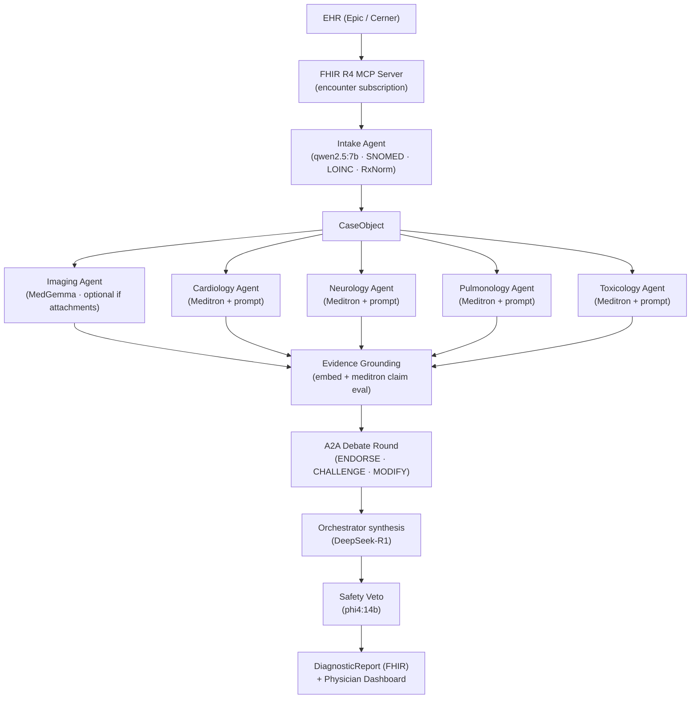

# Shadi

**Multi-agent clinical diagnostic reasoning system for emergency medicine.**

A patient case arrives from the EHR via FHIR R4. **Four specialist agents** — cardiology, neurology, pulmonology, toxicology — use domain-specific prompts over a shared **Ollama** Meditron model (`MEDITRON_MODEL`, default `meditron:70b`; [ADR-004](docs/decisions/adr-004-meditron-via-ollama.md)). They reason in parallel, then **evidence grounding**, a structured **A2A** debate, **orchestrator** synthesis, and a **safety veto**, producing a ranked differential with confidence scores and citations before the physician walks in. Intake (Qwen), imaging (MedGemma), and other models also run on Ollama; optional **vLLM + LoRA** is a Compose profile for experiments ([ADR-003](docs/decisions/adr-003-vllm-base-only-development.md)).

The **target** design also includes intake enrichment of triage text, optional multimodal imaging, and (on vLLM) per-domain LoRA adapters on a shared Meditron base. **What is wired today** is summarized in [Wiring status (as implemented)](#wiring-status-as-implemented).

---

## Why This Exists

Diagnostic errors in emergency medicine are estimated to affect 12 million patients annually in the US. The window between triage and physician assessment is the highest-leverage moment to surface differential diagnoses that a single clinician might miss under time pressure. Shadi is designed to run in that window — locally, with no PHI leaving the machine.

---

## Architecture

Shadi is a **local, air-gapped** stack: **Ollama** serves Meditron and all other agent models by default ([ADR-004](docs/decisions/adr-004-meditron-via-ollama.md)); optional **vLLM + LoRA** is available as a Compose profile ([ADR-003](docs/decisions/adr-003-vllm-base-only-development.md)). FastAPI + arq worker, Postgres/pgvector, Redis, and a Next.js physician dashboard complete the surface. PHI never leaves the machine (see [ADR-001](docs/decisions/adr-001-architecture.md)).

**Specialist count:** exactly **four** domain agents (cardiology, neurology, pulmonology, toxicology) on shared **`MEDITRON_MODEL`**. The imaging agent uses MedGemma on Ollama — multimodal and separate from those four, not a fifth specialist weight load.

### Target architecture (diagram)

The diagram and the [agent pipeline](#agent-pipeline-end-to-end) table describe the **end-state design**. **Implemented routing:** specialists use `OLLAMA_BASE_URL` and `MEDITRON_MODEL` in `agents/specialists/`. Optional vLLM LoRA modules are defined in `docker-compose.yml` under the **`vllm-lora`** profile.



### Agent pipeline (end-to-end)

| Stage | Component | Responsibility |
|---|---|---|
| 0 | **EHR → MCP** | Subscribe to encounters; deliver FHIR R4 bundles into the app |
| 1 | **Intake** | Parse unstructured triage notes; extract SNOMED CT, LOINC, RxNorm codes; build `CaseObject` |
| 2a | **Imaging (optional)** | If `imaging_attachments` exist, MedGemma interprets images; outputs structured findings (skipped when no attachments) |
| 2b | **Specialists ×4** | Cardiology, neurology, pulmonology, toxicology on shared `MEDITRON_MODEL` (Ollama); domain via prompts; reason concurrently; no cross-talk until debate |
| 3 | **Evidence grounding** | Retrieve from local vector index; evaluate whether evidence supports each claim (embedding model + Meditron reuse for claim eval) |
| 4 | **A2A debate** | Structured `ENDORSE / CHALLENGE / MODIFY` messages; orchestrator records consensus and divergence |
| 5 | **Orchestrator synthesis** | Rank differential, confidence scores, reconcile disagreement (dedicated reasoning model — ADR-002) |
| 6 | **Safety veto** | Cross-check diagnostics and treatments vs meds, allergies, contraindications; block unsafe items |
| 7 | **Output** | Top-ranked differential with evidence ties; FHIR `DiagnosticReport`; physician dashboard |

### Wiring status (as implemented)

- **Case intake:** `POST /cases` builds a `CaseObject` from the FHIR R4 bundle via `FHIRNormalizer.bundle_to_case` (`CaseObject.from_fhir_bundle` in `agents/schemas.py`). The LLM **IntakeAgent** (`qwen2.5:7b`) exists under `agents/intake/` and is covered by unit tests, but it is **not** called from `POST /cases` or from `Orchestrator.run()` yet.
- **Diagnostic jobs:** The **`worker`** service runs arq `tasks.pipeline.run_diagnostic_pipeline`, which loads the case from Postgres and calls `Orchestrator().run(case)`. The orchestrator runs **four specialists** (Ollama `MEDITRON_MODEL`) → evidence grounding → A2A debate → orchestrator synthesis → safety veto. **ImageAnalysisAgent** (MedGemma) exists under `agents/specialists/image_agent.py` and is tested in isolation, but it is **not** invoked inside `Orchestrator.run()` yet.
- **FHIR Subscription rest-hook:** Inbound notifications are handled by **`POST /fhir/notify`** on the **api** process (port **8000**), not a separate container. Configure `NOTIFICATION_ENDPOINT`, `FHIR_WEBHOOK_SECRET`, and related vars per `.env.example` when MCP is enabled.
- **Local EHR for #26 / #27:** The in-repo **mock EHR** (`python -m tools.mock_ehr`) implements OAuth token, `Subscription`, and a demo rest-hook to Shadi. See [tools/mock_ehr/README.md](tools/mock_ehr/README.md). It is run **beside** Compose, not included in the default `docker compose up` profile.

---

## Model Stack

**Ollama** serves all chat and embedding models, including **`MEDITRON_MODEL`** for the four specialists and evidence claim evaluation ([ADR-004](docs/decisions/adr-004-meditron-via-ollama.md)). Optional **vLLM + LoRA** is available as a Docker Compose **`vllm-lora`** profile for experiments only — agents do not call it by default. See [ADR-002](docs/decisions/adr-002-model-assignments.md) for historical rationale and amendments.

| Agent | Model | Approx VRAM (indicative) |
|---|---|---|
| Image analysis | `alibayram/medgemma:27b` | ~17 GB |
| Intake | `qwen2.5:7b` | ~4.5 GB |
| Specialists ×4 | `meditron:70b` (shared Ollama tag) | ~39 GB |
| Evidence (retrieval) | `nomic-embed-text` | ~0.5 GB |
| Evidence (claim eval) | `meditron:70b` (same load) | — |
| Safety veto | `phi4:14b` | ~8 GB |
| Orchestrator synthesis | `deepseek-r1:32b` | ~19 GB |

VRAM totals depend on quantization tags and concurrent loads; size a machine for the sum of models you keep resident. See Ollama library pages for each tag.

### Specialists and Meditron

All four specialists call the **same** Ollama model id (`MEDITRON_MODEL`). Clinical differentiation comes from **system prompts** and **domain metadata**, not separate weight loads. To use another Meditron build, set `MEDITRON_MODEL` (e.g. `meditron:70b-q4_K_S`) and `ollama pull` that tag.

---

## Hardware Requirements

| Requirement | Why |
|---|---|
| **128 GB unified memory** | All models + adapters + evidence corpus must be in memory simultaneously for real-time (<2 s) inference |
| **DGX Spark or equivalent** | Only desktop-class machine that meets the memory floor without moving to a data-center GPU |
| **Air-gapped (no cloud API)** | PHI cannot leave the machine; cloud APIs introduce ~200 ms round-trip latency per agent call, killing real-time performance |

A laptop (typically 16–32 GB) OOMs before the first specialist model finishes loading. A cloud API removes the air-gap guarantee required for HIPAA compliance.

---

## Safety Veto — Demo Scenario

The veto's most important moment: **thrombolytics contraindicated in aortic dissection**.

Aortic dissection and STEMI present with overlapping symptoms (chest pain, ST changes). A specialist agent may recommend tPA. Shadi's safety veto agent scans the patient's vitals, imaging flags, and medication context, identifies the aortic dissection risk, and blocks the recommendation with an explicit rationale before output reaches the physician.

This is a documented fatal error pattern in emergency medicine. The veto fires live and the dashboard shows exactly why the recommendation was blocked.

---

## Evaluation Methodology

Shadi is evaluated against **MIMIC-IV de-identified cases**, not just USMLE Q&A benchmarks. USMLE measures recall of medical knowledge; MIMIC-IV measures performance on real patient presentations with the noise, ambiguity, and incomplete information that characterizes actual emergency medicine. Both benchmarks are run; MIMIC-IV is the primary claim.

---

## Quick Start

### Prerequisites

- Docker + Docker Compose
- NVIDIA GPU with 128 GB+ unified memory (or DGX Spark)
- Python 3.11+
- `bun` (for dashboard)

### Run

```bash
cp .env.example .env
# Edit .env — set model paths, EHR connection strings, MOCK_LLM=false for real inference, etc.

docker compose up
```

Agents use the root [`config.py`](config.py) flag **`MOCK_LLM`** (default **`true`**): when true, LLM calls short-circuit to deterministic stubs so the stack runs without downloaded weights. Set **`MOCK_LLM=false`** in `.env` when Ollama is up and models are pulled (enable the optional **`vllm-lora`** profile only if you use HF + LoRA per ADR-003).

On first boot, pull Ollama models (container name may vary — use `docker compose ps`):

```bash
docker compose exec ollama ollama pull meditron:70b
docker compose exec ollama ollama pull alibayram/medgemma:27b
docker compose exec ollama ollama pull qwen2.5:7b
docker compose exec ollama ollama pull nomic-embed-text
docker compose exec ollama ollama pull phi4:14b
docker compose exec ollama ollama pull deepseek-r1:32b
```

Services (Compose):
- `http://localhost:8000` — FastAPI **api** (includes **`POST /fhir/notify`** for Subscription rest-hook when configured)
- `http://localhost:3000` — Physician dashboard
- `http://localhost:11434` — Ollama (all agent models, including Meditron for specialists — [ADR-004](docs/decisions/adr-004-meditron-via-ollama.md))
- `http://localhost:8080` — vLLM (**only** with `--profile vllm-lora`; not used by default agents)
- **`worker`** — arq consumer for `tasks.pipeline.run_diagnostic_pipeline` (no extra HTTP port)

For **OAuth + FHIR Subscription + rest-hook** (#26–#27), default Compose does not bundle a reference FHIR server. Use the in-repo **mock EHR**: [`tools/mock_ehr/README.md`](tools/mock_ehr/README.md) (`python -m tools.mock_ehr`, default port 9001). Optional Dockerized HAPI (or similar) remains future work; see [`docs/cross-track-dependencies.md`](docs/cross-track-dependencies.md) (*Local FHIR or EHR stub (#25)*).

### Optional vLLM (`vllm-lora` profile)

The **`vllm`** service is **not** started by default and is **not** used by agents after ADR-004. To run it for experiments (HF weights + LoRA), use `--profile vllm-lora`, set `MODEL_BASE_PATH` / `LORA_ADAPTERS_PATH`, and run `./scripts/check_vllm_model_base.sh` before expecting `:8080` to answer. See [ADR-003](docs/decisions/adr-003-vllm-base-only-development.md).

### Full case output (Docker Compose — real models + DB)

Use this when you want **Ollama, Postgres, Redis, API, and the arq worker** all running and a **complete diagnostic report** (not `MOCK_LLM`).

**1. Configure `.env` (from `.env.example`)**

- Set **`MOCK_LLM=false`** so the API/worker call real inference.
- Set **`MEDITRON_MODEL`** if you use a non-default Meditron tag (default `meditron:70b`).
- Set a real **`API_SECRET_KEY`** (not a placeholder).
- Ensure **`EVIDENCE_INDEX_PATH`** on the host exists and points at your evidence index (Compose mounts it read-only into the API). Create an empty directory if you only need the stack to start; evidence quality depends on a real index.
- Leave **`DATABASE_URL`** in `.env` as localhost for host-side tools; **Compose overrides** `DATABASE_URL` and `OLLAMA_BASE_URL` inside `api` / `worker` automatically.

**2. Start the stack**

```bash
docker compose up -d
```

Wait until `postgres`, `redis`, `ollama`, `api`, and `worker` are healthy (`docker compose ps`).

**3. Pull Ollama models (first time only)**

```bash
docker compose exec ollama ollama pull meditron:70b
docker compose exec ollama ollama pull alibayram/medgemma:27b
docker compose exec ollama ollama pull qwen2.5:7b
docker compose exec ollama ollama pull nomic-embed-text
docker compose exec ollama ollama pull phi4:14b
docker compose exec ollama ollama pull deepseek-r1:32b
```

**4. Smoke-check inference**

```bash
curl -sf http://localhost:11434/api/tags
curl -sf http://localhost:8000/health
```

**5. Enqueue a case and read the report**

Full **`CaseObject` from FHIR** (requires a valid bundle for your normalizer), or temporarily **`SHADI_STUB_CASE_INTAKE=1`** in `.env` with any JSON body for a stub case (restart `api` + `worker` after changing `.env`).

```bash
# Example: POST a bundle (adjust path if not run from repo root)
RESP=$(curl -s -X POST http://localhost:8000/cases \
  -H "Content-Type: application/json" \
  -d @tests/fixtures/sample_bundle.json)
echo "$RESP"
CASE_ID=$(echo "$RESP" | python3 -c "import sys, json; print(json.load(sys.stdin)['case_id'])")

# Poll until complete (pipeline runs in the worker)
while true; do
  STATUS=$(curl -s "http://localhost:8000/reports/${CASE_ID}/status" | python3 -c "import sys, json; print(json.load(sys.stdin).get('status',''))")
  echo "status=$STATUS"
  [ "$STATUS" = "complete" ] && break
  sleep 3
done

curl -s "http://localhost:8000/reports/${CASE_ID}" | python3 -m json.tool
```

If `sample_bundle.json` returns **422**, the normalizer rejected it — use a bundle that matches `CaseObject.from_fhir_bundle` or enable **`SHADI_STUB_CASE_INTAKE=1`** for an end-to-end wiring check.

**6. Optional: live orchestrator on the host (same models as `.env`)**

Requires **Postgres and Ollama reachable from the host** (`localhost:5432`, `11434`) and **`.venv`** with the package installed:

```bash
export MOCK_LLM=false
.venv/bin/python tests/integration/run_live_cli.py
```

### Development

Many Linux images ship **`python3`** only (no `python` on `PATH`). Use **`python3`** and a project venv so `pytest` and Shadi share one interpreter:

```bash
python3 -m venv .venv
.venv/bin/pip install -e ".[dev]"

# Tests (works without activating the venv)
./scripts/run_tests.sh
# Or: .venv/bin/python -m pytest tests/ -q

# Multi-agent CLI: full orchestrator, formatted report on stdout (MOCK_LLM; no Ollama).
# Re-runs under ``.venv/bin/python`` when a repo ``.venv`` exists.
python3 -m tools.shadi_run_case_cli
# Optional: mock triage narrative → FHIR bundle (issue #70) → same pipeline
python3 -m tools.shadi_run_case_cli --triage-text "Chest pain x2h, diaphoretic." --chief-complaint "Chest pain"
# Real Ollama + Postgres (uses ``.env``; slow):
python3 -m tools.shadi_run_case_cli --live

# Same pipeline via pytest (``MOCK_LLM=false`` subprocess; see ADR-002 / ADR-004):
# .venv/bin/python -m pytest tests/integration/test_shadi_live_cli_output.py --live-inference -s

# API locally
.venv/bin/uvicorn api.main:app --reload
```

```bash
# Dashboard
cd dashboard
bun install
bun dev
```

---

## Directory Structure

```
shadi/
├── agents/
│   ├── base.py                  # BaseAgent ABC
│   ├── intake/                  # IntakeAgent (Qwen) — see Wiring status
│   ├── specialists/             # Four LoRA specialists + image_agent (MedGemma)
│   ├── evidence/                # PubMed + guidelines cross-reference
│   ├── safety/                  # Safety veto agent
│   └── orchestrator/            # Fan-out, A2A debate, synthesis
├── shadi_fhir/                  # FHIR R4 normalizer + MCP (OAuth #26, Subscription/notify #27, teardown #29)
├── a2a/                         # A2A protocol schema + debate round logic
├── models/                      # Optional local inference helpers (vLLM-related)
├── api/                         # FastAPI app + routes (incl. POST /fhir/notify)
├── tasks/                       # arq worker + pipeline job
├── tools/
│   └── mock_ehr/                # Local mock EHR for OAuth + Subscription + rest-hook demos
├── dashboard/                   # Next.js physician dashboard
├── skills/                      # Shared Cursor/agent skills (see AGENTS.md)
├── scripts/                     # Repo maintenance scripts
├── docs/decisions/              # Architecture Decision Records
├── config.py                    # Agent settings (MOCK_LLM, inference URLs)
├── docker-compose.yml           # vLLM + Ollama + api + worker + postgres + redis + dashboard
├── pyproject.toml
└── tests/
    ├── fixtures/                # FHIR bundles, report JSON for tests
    └── unit/
```

---

## Architecture Decision Records

| ADR | Decision |
|---|---|
| [ADR-001](docs/decisions/adr-001-architecture.md) | LoRA adapter strategy, A2A protocol design, air-gap rationale |
| [ADR-002](docs/decisions/adr-002-model-assignments.md) | Ollama model assignments per agent, two-server strategy, memory budget |
| [ADR-003](docs/decisions/adr-003-vllm-base-only-development.md) | Optional vLLM Compose profile (`vllm-lora`) + HF base path preflight |
| [ADR-004](docs/decisions/adr-004-meditron-via-ollama.md) | Specialists + claim eval use Ollama `MEDITRON_MODEL` (default `meditron:70b`) |

---

## Contributing

All architecture decisions must be documented in `docs/decisions/` before implementation. See `docs/decisions/adr-001-architecture.md` for the format.
