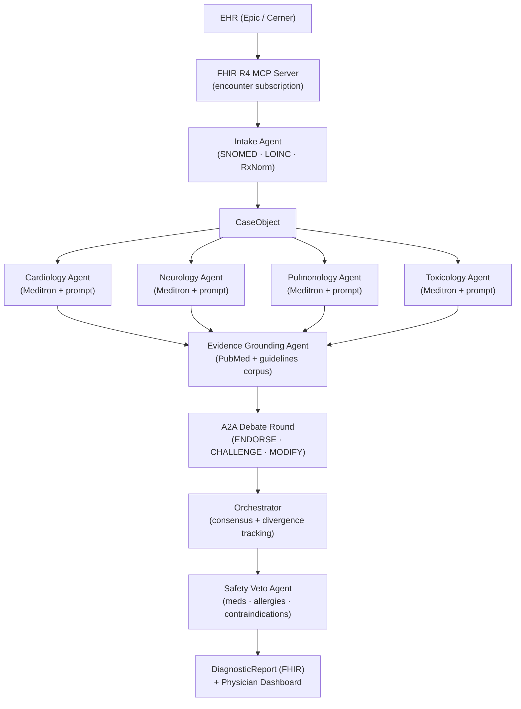

# Shadi

**Multi-agent clinical diagnostic reasoning system for emergency medicine.**

A patient case arrives from the EHR via FHIR R4. Five specialist agents — each using domain-specific prompts over a shared **Ollama** Meditron model (`MEDITRON_MODEL`, default `meditron:70b`) — reason independently over the case, debate via a structured A2A protocol, and produce a ranked differential diagnosis with confidence scores, evidence citations, and a safety veto layer. The attending physician receives this before walking into the room. See [ADR-004](docs/decisions/adr-004-meditron-via-ollama.md).

---

## Why This Exists

Diagnostic errors in emergency medicine are estimated to affect 12 million patients annually in the US. The window between triage and physician assessment is the highest-leverage moment to surface differential diagnoses that a single clinician might miss under time pressure. Shadi is designed to run in that window — locally, with no PHI leaving the machine.

---

## Architecture



### Agent Pipeline

| Stage | Agent | Responsibility |
|---|---|---|
| 1 | **Intake** | Parse unstructured triage notes; extract SNOMED CT, LOINC, RxNorm codes; build `CaseObject` |
| 2 | **Specialists ×4** | Cardiology, neurology, pulmonology, toxicology reason concurrently; no cross-talk yet |
| 3 | **Evidence Grounding** | Each specialist's findings cross-referenced against local PubMed + clinical guidelines corpus; unsupported claims flagged |
| 4 | **A2A Debate** | Agents exchange structured `ENDORSE / CHALLENGE / MODIFY` messages; orchestrator tracks consensus and divergence |
| 5 | **Safety Veto** | Every recommended diagnostic step and treatment cross-checked against active medications, allergies, and contraindications; unsafe items blocked before output |
| 6 | **Output Synthesis** | Top-5 ranked differential with confidence %, evidence citations, and next steps written as FHIR `DiagnosticReport`; surfaced on physician dashboard |

---

## Model Stack

**Ollama** serves all chat and embedding models, including **`MEDITRON_MODEL`** for the four specialists and evidence claim evaluation ([ADR-004](docs/decisions/adr-004-meditron-via-ollama.md)). Optional **vLLM + LoRA** is available as a Docker Compose **`vllm-lora`** profile for experiments only — agents do not call it by default. See [ADR-002](docs/decisions/adr-002-model-assignments.md) for historical rationale and amendments.

| Agent | Model | Approx VRAM (indicative) |
|---|---|---|
| Image analysis | `alibayram/medgemma:27b` | ~17 GB |
| Intake | `qwen2.5:7b` | ~4.5 GB |
| Specialists ×4 | `meditron:70b` (shared Ollama tag) | ~39 GB |
| Evidence (retrieval) | `nomic-embed-text` | ~0.5 GB |
| Evidence (claim eval) | `meditron:70b` (same load) | — |
| Safety veto | `phi4:14b` | ~8 GB |
| Orchestrator synthesis | `deepseek-r1:32b` | ~19 GB |

VRAM totals depend on quantization tags and concurrent loads; size a machine for the sum of models you keep resident. See Ollama library pages for each tag.

### Specialists and Meditron

All four specialists call the **same** Ollama model id (`MEDITRON_MODEL`). Clinical differentiation comes from **system prompts** and **domain metadata**, not separate weight loads. To use another Meditron build, set `MEDITRON_MODEL` (e.g. `meditron:70b-q4_K_S`) and `ollama pull` that tag.

---

## Hardware Requirements

| Requirement | Why |
|---|---|
| **128 GB unified memory** | All models + adapters + evidence corpus must be in memory simultaneously for real-time (<2 s) inference |
| **DGX Spark or equivalent** | Only desktop-class machine that meets the memory floor without moving to a data-center GPU |
| **Air-gapped (no cloud API)** | PHI cannot leave the machine; cloud APIs introduce ~200 ms round-trip latency per agent call, killing real-time performance |

A laptop (typically 16–32 GB) OOMs before the first specialist model finishes loading. A cloud API removes the air-gap guarantee required for HIPAA compliance.

---

## Safety Veto — Demo Scenario

The veto's most important moment: **thrombolytics contraindicated in aortic dissection**.

Aortic dissection and STEMI present with overlapping symptoms (chest pain, ST changes). A specialist agent may recommend tPA. Shadi's safety veto agent scans the patient's vitals, imaging flags, and medication context, identifies the aortic dissection risk, and blocks the recommendation with an explicit rationale before output reaches the physician.

This is a documented fatal error pattern in emergency medicine. The veto fires live and the dashboard shows exactly why the recommendation was blocked.

---

## Evaluation Methodology

Shadi is evaluated against **MIMIC-IV de-identified cases**, not just USMLE Q&A benchmarks. USMLE measures recall of medical knowledge; MIMIC-IV measures performance on real patient presentations with the noise, ambiguity, and incomplete information that characterizes actual emergency medicine. Both benchmarks are run; MIMIC-IV is the primary claim.

---

## Quick Start

### Prerequisites

- Docker + Docker Compose
- NVIDIA GPU with 128 GB+ unified memory (or DGX Spark)
- Python 3.11+
- `bun` (for dashboard)

### Run

```bash
cp .env.example .env
# Edit .env — set model paths, EHR connection strings, etc.

docker compose up
```

On first boot, pull Ollama models (container name may vary — use `docker compose ps`):

```bash
docker compose exec ollama ollama pull meditron:70b
docker compose exec ollama ollama pull alibayram/medgemma:27b
docker compose exec ollama ollama pull qwen2.5:7b
docker compose exec ollama ollama pull nomic-embed-text
docker compose exec ollama ollama pull phi4:14b
docker compose exec ollama ollama pull deepseek-r1:32b
```

Services:
- `http://localhost:8000` — FastAPI backend
- `http://localhost:3000` — Physician dashboard
- `http://localhost:11434` — Ollama (all models, including Meditron for specialists — [ADR-004](docs/decisions/adr-004-meditron-via-ollama.md))

### Optional vLLM (`vllm-lora` profile)

The **`vllm`** service is **not** started by default and is **not** used by agents after ADR-004. To run it for experiments (HF weights + LoRA), use `--profile vllm-lora`, set `MODEL_BASE_PATH` / `LORA_ADAPTERS_PATH`, and run `./scripts/check_vllm_model_base.sh` before expecting `:8080` to answer. See [ADR-003](docs/decisions/adr-003-vllm-base-only-development.md).

### Full case output (Docker Compose — real models + DB)

Use this when you want **Ollama, Postgres, Redis, API, and the arq worker** all running and a **complete diagnostic report** (not `MOCK_LLM`).

**1. Configure `.env` (from `.env.example`)**

- Set **`MOCK_LLM=false`** so the API/worker call real inference.
- Set **`MEDITRON_MODEL`** if you use a non-default Meditron tag (default `meditron:70b`).
- Set a real **`API_SECRET_KEY`** (not a placeholder).
- Ensure **`EVIDENCE_INDEX_PATH`** on the host exists and points at your evidence index (Compose mounts it read-only into the API). Create an empty directory if you only need the stack to start; evidence quality depends on a real index.
- Leave **`DATABASE_URL`** in `.env` as localhost for host-side tools; **Compose overrides** `DATABASE_URL` and `OLLAMA_BASE_URL` inside `api` / `worker` automatically.

**2. Start the stack**

```bash
docker compose up -d
```

Wait until `postgres`, `redis`, `ollama`, `api`, and `worker` are healthy (`docker compose ps`).

**3. Pull Ollama models (first time only)**

```bash
docker compose exec ollama ollama pull meditron:70b
docker compose exec ollama ollama pull alibayram/medgemma:27b
docker compose exec ollama ollama pull qwen2.5:7b
docker compose exec ollama ollama pull nomic-embed-text
docker compose exec ollama ollama pull phi4:14b
docker compose exec ollama ollama pull deepseek-r1:32b
```

**4. Smoke-check inference**

```bash
curl -sf http://localhost:11434/api/tags
curl -sf http://localhost:8000/health
```

**5. Enqueue a case and read the report**

Full **`CaseObject` from FHIR** (requires a valid bundle for your normalizer), or temporarily **`SHADI_STUB_CASE_INTAKE=1`** in `.env` with any JSON body for a stub case (restart `api` + `worker` after changing `.env`).

```bash
# Example: POST a bundle (adjust path if not run from repo root)
RESP=$(curl -s -X POST http://localhost:8000/cases \
  -H "Content-Type: application/json" \
  -d @tests/fixtures/sample_bundle.json)
echo "$RESP"
CASE_ID=$(echo "$RESP" | python3 -c "import sys, json; print(json.load(sys.stdin)['case_id'])")

# Poll until complete (pipeline runs in the worker)
while true; do
  STATUS=$(curl -s "http://localhost:8000/reports/${CASE_ID}/status" | python3 -c "import sys, json; print(json.load(sys.stdin).get('status',''))")
  echo "status=$STATUS"
  [ "$STATUS" = "complete" ] && break
  sleep 3
done

curl -s "http://localhost:8000/reports/${CASE_ID}" | python3 -m json.tool
```

If `sample_bundle.json` returns **422**, the normalizer rejected it — use a bundle that matches `CaseObject.from_fhir_bundle` or enable **`SHADI_STUB_CASE_INTAKE=1`** for an end-to-end wiring check.

**6. Optional: live orchestrator on the host (same models as `.env`)**

Requires **Postgres and Ollama reachable from the host** (`localhost:5432`, `11434`) and **`.venv`** with the package installed:

```bash
export MOCK_LLM=false
.venv/bin/python tests/integration/run_live_cli.py
```

### Development

Many Linux images ship **`python3`** only (no `python` on `PATH`). Use **`python3`** and a project venv so `pytest` and Shadi share one interpreter:

```bash
python3 -m venv .venv
.venv/bin/pip install -e ".[dev]"

# Tests (works without activating the venv)
./scripts/run_tests.sh
# Or: .venv/bin/python -m pytest tests/ -q

# Multi-agent CLI: full orchestrator, formatted report on stdout (MOCK_LLM; no Ollama).
# Re-runs under ``.venv/bin/python`` when a repo ``.venv`` exists.
python3 -m tools.shadi_run_case_cli
# Optional: mock triage narrative → FHIR bundle (issue #70) → same pipeline
python3 -m tools.shadi_run_case_cli --triage-text "Chest pain x2h, diaphoretic." --chief-complaint "Chest pain"
# Real Ollama + Postgres (uses ``.env``; slow):
python3 -m tools.shadi_run_case_cli --live

# Same pipeline via pytest (``MOCK_LLM=false`` subprocess; see ADR-002 / ADR-004):
# .venv/bin/python -m pytest tests/integration/test_shadi_live_cli_output.py --live-inference -s

# API locally
.venv/bin/uvicorn api.main:app --reload
```

```bash
# Dashboard
cd dashboard
bun install
bun dev
```

---

## Directory Structure

```
shadi/
├── agents/
│   ├── base.py                  # BaseAgent ABC
│   ├── intake/                  # Triage note parsing → CaseObject
│   ├── specialists/             # Cardiology, neurology, pulmonology, toxicology
│   ├── evidence/                # PubMed + guidelines cross-reference
│   ├── safety/                  # Safety veto agent
│   └── orchestrator/            # Fan-out, A2A debate, synthesis
├── shadi_fhir/                  # FHIR R4 normalizer + MCP (OAuth #26, Subscription/notify #27, teardown #29)
├── a2a/                         # A2A protocol schema + debate round logic
├── models/                      # Optional local inference helpers (vLLM-related)
├── api/                         # FastAPI app + routes
├── dashboard/                   # Next.js physician dashboard
├── docs/decisions/              # Architecture Decision Records
└── tests/
    ├── fixtures/sample_cases/   # De-identified MIMIC-IV fixtures
    └── unit/
```

---

## Architecture Decision Records

| ADR | Decision |
|---|---|
| [ADR-001](docs/decisions/adr-001-architecture.md) | LoRA adapter strategy, A2A protocol design, air-gap rationale |
| [ADR-002](docs/decisions/adr-002-model-assignments.md) | Ollama model assignments per agent, two-server strategy, memory budget |
| [ADR-003](docs/decisions/adr-003-vllm-base-only-development.md) | Optional vLLM Compose profile (`vllm-lora`) + HF base path preflight |
| [ADR-004](docs/decisions/adr-004-meditron-via-ollama.md) | Specialists + claim eval use Ollama `MEDITRON_MODEL` (default `meditron:70b`) |

---

## Contributing

All architecture decisions must be documented in `docs/decisions/` before implementation. See `docs/decisions/adr-001-architecture.md` for the format.
